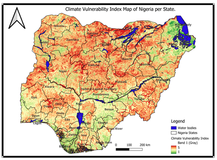

# Integrating Flood Susceptibility and Deforestation Mapping for Climate Vulnerability Assessment: A Geospatial and AI-Based Approach

## Overview

This study developed a comprehensive Climate Vulnerability Index (CVI) by integrating flood susceptibility and drought risk mapping across Nigeria using machine learning and multi-criteria decision analysis — shifting from single-hazard approaches to a unified, multi-hazard assessment system that supports risk-informed planning at national, state, and local levels.

**Study Area:** Nigeria  
**Duration:** 2024 – 2025  
**Role:** Lead Author / Contributor  
**Status:** Completed

---

## Methods & Tools

**Data Sources**

- Rainfall — CHIRPS Daily Raster (2019–2024)
- Temperature — TerraClimate (2019–2024)
- Elevation — Shuttle Radar Topography Mission (SRTM)
- Hydrological data — WWF HydroSHEDS Flow Accumulation
- Vegetation Index (NDVI) — MODIS Data
- Land Use — ESA WorldCover 10m v100
- Soil pH — OpenLandMap
- Surface Water — JRC Yearly Water Classification History
- Roads & Rivers — DivaGIS

**Processing Steps**

1. Preprocessed all geospatial datasets in Google Earth Engine, including indices calculation, feature derivation, and spatial analysis
2. Computed topographic parameters (slope, aspect, TWI, TPI, SPI) and proximity features (distance to road and river)
3. Trained and evaluated Random Forest, XGBoost, and LightGBM classifiers for flood susceptibility mapping using a 70/30 stratified split
4. Conducted multi-criteria analysis in QGIS using a weighted overlay (60:40 flood-to-drought ratio) to produce the final Climate Vulnerability Index (CVI) map

**Tools Used**

| Tool | Purpose |
|------|---------|
| Google Earth Engine | Data preprocessing, indices calculation, feature derivation |
| Python (rasterio, scikit-learn) | ML pipeline, model training and evaluation |
| QGIS | Multi-criteria weighted overlay analysis |
| Random Forest / XGBoost / LightGBM | Flood susceptibility classification |

---

## Key Findings

- Random Forest achieved the highest AUC of 0.85, outperforming XGBoost (0.79) and LightGBM (0.76)
- Elevation, rainfall, temperature, and proximity to roads and rivers were the most influential predictors of flood susceptibility
- States in northeastern and central Nigeria exhibit the highest climate vulnerability, consistent with areas frequently impacted by extreme weather and drought
- The resulting CVI map provides a scalable, evidence-based tool supporting SDG 13 (Climate Action), SDG 11 (Sustainable Cities), and SDG 2 (Zero Hunger)

---

## Links

[Read the Paper — NeurIPS Climate Change Workshop 2025](#){ .md-button }
